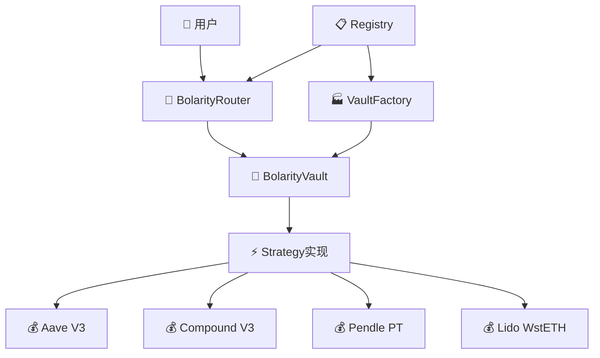
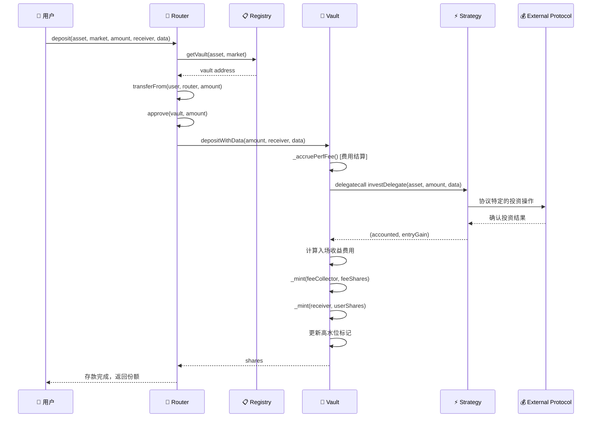
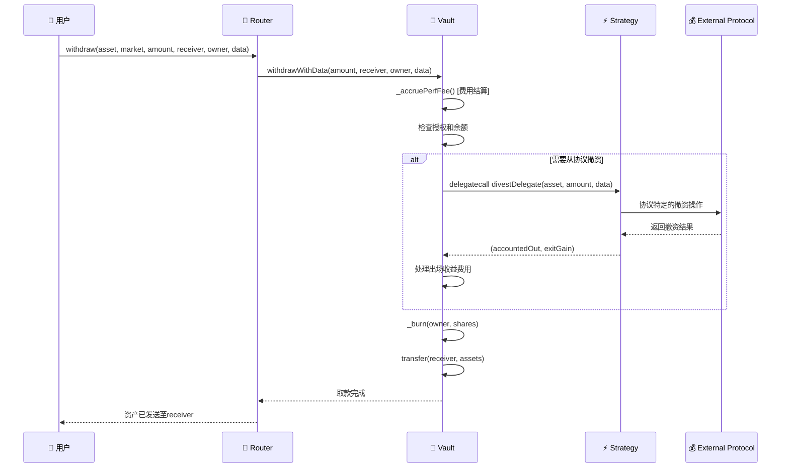

# Bolarity Vault Router - Smart Contract Architecture

本文档详细解释了 Bolarity Vault Router 的智能合约架构、数据流转方式和业务构建逻辑。

## 🏗️ 核心架构概览



## 📁 合约文件结构

```
contracts/
├── 🔀 BolarityRouter.sol     # 主入口路由器 - 用户交互层
├── 🏦 BolarityVault.sol      # ERC4626资金库 - 资产管理核心
├── 📋 Registry.sol           # 注册表 - 资金库索引
├── 🏭 VaultFactory.sol       # 工厂合约 - 资金库创建
├── 📄 interfaces/            # 接口定义
│   ├── IBolarityRouter.sol
│   ├── IBolarityVault.sol
│   ├── IRegistry.sol
│   ├── IStrategy.sol
│   └── ...
└── ⚡ strategies/            # 收益策略实现
    ├── AaveStrategy.sol      # Aave V3协议策略
    ├── CompoundStrategy.sol  # Compound V3协议策略
    ├── PendlePTStrategy.sol  # Pendle主本票策略
    └── WstETHStrategy.sol    # Lido流动性质押策略
```

---

## 🏗️ 核心组件详解

### 1️⃣ **BolarityRouter** - 统一入口路由器

**职责**: 用户交互的主要入口，提供统一的存取款接口

**核心功能**:
- 🔄 **资产路由**: 根据 `(asset, market)` 定位对应的资金库
- 💰 **存款操作**: `deposit()`, `mint()` - 支持自定义策略数据
- 🏧 **取款操作**: `withdraw()`, `redeem()` - 支持代理取款
- 📊 **预览功能**: 计算存取款的份额/资产转换比例
- 🚨 **应急功能**: 批量操作和紧急提取

**关键设计**:
```solidity
// 核心路由逻辑
function deposit(address asset, bytes32 market, uint256 assets, address receiver, bytes calldata data)
    returns (uint256 shares)
{
    address vault = _getVault(asset, market);  // 通过Registry查找资金库
    IERC20(asset).safeTransferFrom(msg.sender, address(this), assets);
    IERC20(asset).safeIncreaseAllowance(vault, assets);
    shares = IBolarityVault(vault).depositWithData(assets, receiver, data);
}
```

### 2️⃣ **BolarityVault** - ERC4626资产管理核心

**职责**: 符合ERC4626标准的资金库，管理用户资产和收益分配

**核心特性**:
- 📊 **ERC4626标准**: 标准化的资金库接口
- 💎 **性能费用**: 高水位标记 + 可配置费率(最高30%)
- 🔄 **代理调用**: 通过delegatecall调用策略合约实现无状态设计
- ⚖️ **精确会计**: 处理策略投资时的入场/出场收益和费用分配
- 🔒 **安全控制**: 重入保护、暂停机制、所有权管理

**费用机制**:
```solidity
// 高水位标记性能费用计算
function _accruePerfFee() internal returns (uint256 feeShares) {
    uint256 P1 = (totalAssets() * PRECISION) / totalSupply();  // 当前每份额价值
    if (P1 <= lastP) return 0;  // 未突破高水位，无费用

    uint256 dP = P1 - lastP;  // 收益增长
    uint256 feeShares = (totalSupply() * perfFeeBps * dP) /
                       ((P1 * BPS_DIVISOR) - (perfFeeBps * dP));
    _mint(feeCollector, feeShares);  // 铸造费用份额
    lastP = P1;  // 更新高水位
}
```

**策略集成流程**:
```solidity
// 通过delegatecall执行策略投资
function _executeDeposit(uint256 assets, address receiver, uint256 A0, uint256 S0, bytes memory strategyData)
    returns (uint256 shares)
{
    // 1. 策略执行：通过delegatecall调用策略的investDelegate
    (bool success, bytes memory returnData) = strategy.delegatecall(
        abi.encodeWithSignature("investDelegate(address,uint256,bytes)", asset(), assets, strategyData)
    );

    // 2. 解码返回值：(accounted, entryGain)
    (uint256 accounted, uint256 entryGain) = abi.decode(returnData, (uint256, uint256));

    // 3. 入场收益费用处理
    if (entryGain > 0 && perfFeeBps > 0) {
        uint256 feeAssetsOnEntry = (entryGain * perfFeeBps) / BPS_DIVISOR;
        uint256 netAccounted = accounted - feeAssetsOnEntry;
        // 计算并铸造费用份额...
    }

    // 4. 铸造用户份额
    _mint(receiver, shares);
}
```

### 3️⃣ **Registry** - 资金库注册表

**职责**: 维护 `(asset, market) → vault` 的映射关系

**核心数据结构**:
```solidity
mapping(address => mapping(bytes32 => address)) private vaults;  // asset -> market -> vault
mapping(address => bytes32) private preferredMarkets;           // asset -> preferred market
```

**关键功能**:
- 📝 **资金库注册**: 建立资产-市场-资金库三元组映射
- 🔍 **资金库查询**: Router通过此合约定位具体资金库
- ⭐ **首选市场**: 为每种资产设置默认策略市场

### 4️⃣ **VaultFactory** - 资金库工厂

**职责**: 标准化创建和部署资金库实例

**创建流程**:
```solidity
function createVault(address asset, bytes32 market, address strategy, ...)
    returns (address vault)
{
    // 1. 确定性地址计算
    bytes32 salt = keccak256(abi.encodePacked(asset, market));

    // 2. 克隆实现合约
    vault = vaultImplementation.cloneDeterministic(salt);

    // 3. 初始化资金库
    BolarityVault(vault).initialize(IERC20(asset), name, symbol, strategy, ...);

    // 4. 注册到Registry
    registry.registerVault(asset, market, vault);
}
```

**设计优势**:
- 🏭 **代理模式**: 使用OpenZeppelin Clones节约Gas成本
- 🎯 **确定性地址**: 可预测的资金库地址
- 🔧 **标准化配置**: 统一的创建和初始化流程

---

## ⚡ 策略架构 - 无状态设计哲学

### 策略设计原则

所有策略合约采用**无状态设计**，通过`delegatecall`在Vault上下文中执行：

```solidity
interface IStrategy {
    // 投资接口 - 通过delegatecall调用
    function investDelegate(address asset, uint256 amountIn, bytes calldata data)
        external returns (uint256 accounted, uint256 entryGain);

    // 撤资接口 - 通过delegatecall调用
    function divestDelegate(address asset, uint256 amountOut, bytes calldata data)
        external returns (uint256 accountedOut, uint256 exitGain);

    // 余额查询 - 外部调用
    function totalUnderlying(address vault) external view returns (uint256);

    // 投资预览 - 外部调用
    function previewInvest(address asset, uint256 amountIn)
        external view returns (uint256 accounted, uint256 entryGain);
}
```

### 策略实现案例

#### 🟦 **AaveStrategy** - Aave V3协议
- **机制**: 1:1存款获得计息aToken
- **收益模式**: 时间累积，无入场/出场收益
- **实现**: 直接调用 `aavePool.supply()` / `aavePool.withdraw()`

#### 🟪 **CompoundStrategy** - Compound V3协议
- **机制**: 向Comet合约存款基础资产
- **收益模式**: 余额随时间增长，无入场/出场收益
- **配置**: 支持多资产，每个资产配置对应的Comet地址

#### 🟨 **PendlePTStrategy** - Pendle主本票策略
- **机制**: 购买Pendle PT获得固定收益
- **收益模式**: 购买时获得入场收益，到期时获得本金
- **特点**: 有入场收益，需要处理到期逻辑

#### 🟩 **WstETHStrategy** - Lido流动性质押
- **机制**: ETH质押获得wstETH
- **收益模式**: wstETH价值随时间增长
- **特点**: 支持ETH和wstETH双向转换

---

## 🔄 完整数据流转分析

### 💰 存款流程 (Deposit Flow)



### 🏧 取款流程 (Withdraw Flow)



---

## 🎯 业务模式构建逻辑

### 🏦 多市场资金库架构

**设计理念**: 每个`(资产, 市场)`组合对应一个独立的资金库

```
USDC资产：
├── (USDC, "AAVE-V3")    → Aave策略资金库
├── (USDC, "COMPOUND-V3") → Compound策略资金库
└── (USDC, "CUSTOM-STRATEGY") → 自定义策略资金库

ETH资产：
├── (ETH, "LIDO-WSTETH")  → Lido质押资金库
└── (ETH, "PENDLE-PT")    → Pendle固收资金库
```

### 💎 收益优化机制

1. **性能费用系统**
   - 高水位标记确保只对净收益收费
   - 可配置费率(0-30%)，默认20%
   - 费用以份额形式发放给费用收集者

2. **策略灵活性**
   - 支持热插拔策略替换
   - 无状态策略设计便于升级
   - 自定义数据传递支持复杂策略参数

3. **资金效率**
   - ERC4626标准化接口便于集成
   - 代理模式降低部署成本
   - 批量操作减少Gas消耗

### 🔐 安全保障机制

1. **多层访问控制**
   - Router层：重入保护、暂停机制
   - Vault层：所有权管理、授权检查
   - Strategy层：参数验证、协议交互安全

2. **资金隔离**
   - 每个资金库独立管理资产
   - 策略失败不影响其他资金库
   - 紧急提取功能保障资金安全

3. **升级能力**
   - 策略可替换设计
   - 代理模式支持功能扩展
   - 注册表统一管理便于维护

---

## 🚀 部署和集成指南

### 部署顺序
1. 部署 **Registry** 合约
2. 部署 **VaultFactory** 合约(传入Registry地址)
3. 部署 **BolarityRouter** 合约(传入Registry和Factory地址)
4. 部署各种 **Strategy** 合约
5. 通过Factory创建具体的Vault实例

### 集成新策略
1. 实现 `IStrategy` 接口
2. 确保 `delegatecall` 安全性
3. 部署策略合约
4. 通过Factory创建使用该策略的Vault
5. 在Registry中注册新的Vault

### 使用示例
```solidity
// 1. 存款到Aave策略
router.deposit(
    USDC_ADDRESS,
    keccak256("AAVE-V3"),
    1000e6,  // 1000 USDC
    msg.sender,
    ""  // 无额外数据
);

// 2. 取款
router.withdraw(
    USDC_ADDRESS,
    keccak256("AAVE-V3"),
    500e6,  // 500 USDC
    msg.sender,
    msg.sender,
    ""  // 无额外数据
);
```

---

## 📊 关键指标监控

- **TVL**: `vault.totalAssets()` - 总锁定价值
- **收益率**: `vault.convertToAssets(1e18)` - 每份额资产价值
- **费用收取**: 监控 `FeeCrystallized` 事件
- **策略表现**: 对比不同市场的收益率
- **用户活动**: 追踪 `Deposit`/`Withdraw` 事件

这个架构通过模块化设计、无状态策略和标准化接口，构建了一个灵活、安全、可扩展的DeFi收益聚合协议。